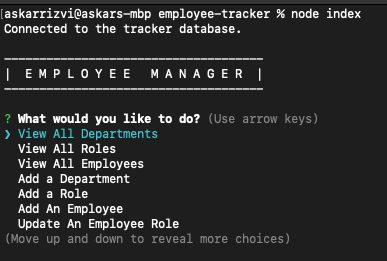
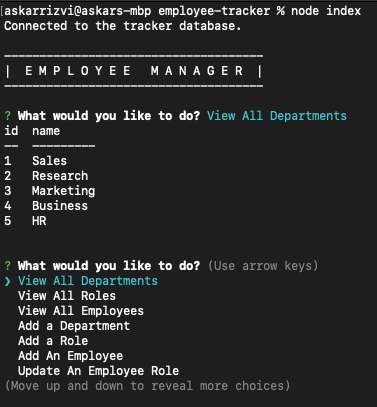
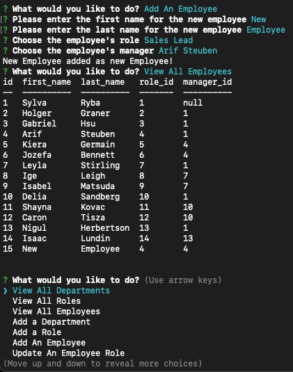
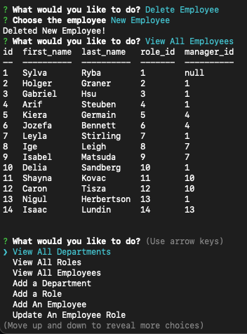
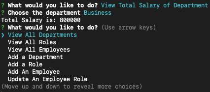

# Employee Manager
  

  ## Description
  This week's challenge requires building an Employee Manager tool using node, inquirer and mySQL. MySQL is used to store the database for the employee information, and inquirer is used to show the main menu and prompt the user to make a selection. Based on the user's selection, the application will call different SQL queries using the MySQL asynchronous query function and either display the result in a table or make modifications to the database.

  ## Table of Contents

* [Installation](#installation)
* [Usage](#usage)
* [License](#license)
* [Questions](#questions)

## Installation
1: Clone the repository 2:  Run "npm install" to install the modules 3:  Run "node index" to run the application 

## Usage

## License
https://www.gnu.org/licenses/gpl-3.0  
Licensed under GNU GPLv3

## Questions
https://github.com/askarrizvi  
